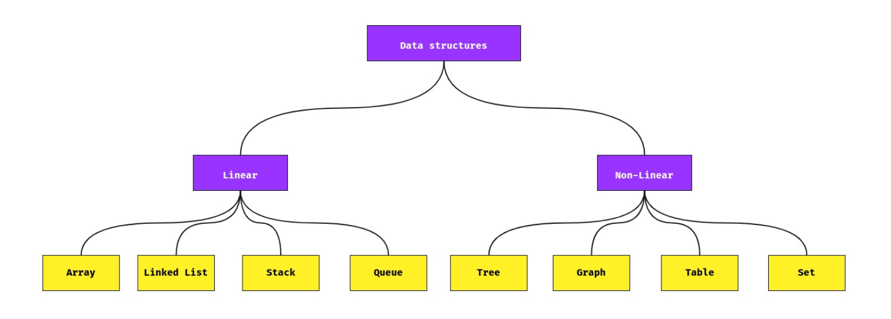

# Data Structures

Data Structures are a specialized manner of organizing and storing data in computers in such a way that we can perform operations on the stored data more efficiently.

Data structures have a wide and diverse scope of usage across the fields of Computer Science and Software Engineering.

## The Project

This repository has documentation/implementation for each data structure mentioned. You can navigate the directories to find out more about every data structure discussed here.
