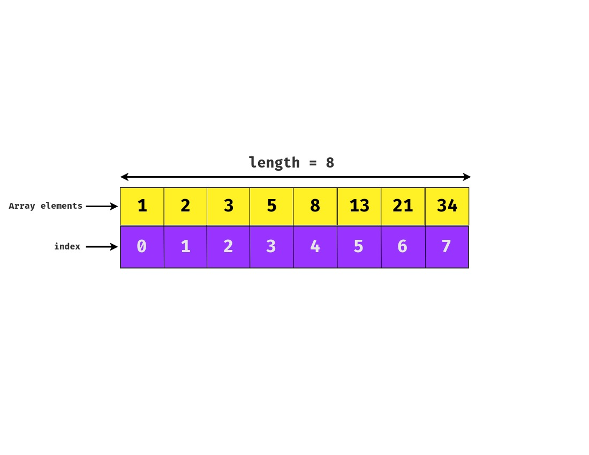

# Data structure - Array

## Definition

Arrays are used to **store multiple elements of the same type in a single variable**. Values are stored in **contiguous memory location** and can be **accessed by using an index** to a unique identifier.

## Array types

- **Unidimensional Array** - Can be used to **store horizontal data (vector, list, etc)**.
- **Multidimensional Array** - Can be used to **store horizontal and vertical data (table, matrix, image processing, etc)**.

## Advantages of Arrays over Linked Lists

- **Easier element access**, can be **accessed** using an index.
- **Less memory usage** when compared to Linked List. **Only stores data**.

## Drawbacks of Arrays

- **Unsafe consistency**. Element can be **inserted at any position** using an index, that can lead to **overriding an existing element**. Also, when redimensioning an Array, all elements **need to be copied to a new memory address**.
- **Complex insertion/removal**. The complexity comes on manipulating data in the beginning or in the middle of the Array, where **is necessary to shift elements to perform an insertion or removal**.

## Algorithm time complexity (Big O Notation)

The table shown below represents the **time complexity of performing different operations** on Arrays.

| Operation                        | Notation |
| -------------------------------- | -------- |
| Cost of accessing elements       | **O(1)** |
| Insert/remove from the beginning | **O(n)** |
| Insert/remove from the end       | **O(1)** |
| Insert/remove from middle        | **O(n)** |

## Common operations

- `push`  - Adds an element to the end of the Array.
- `pop` - Removes and returns the last element of the Array.
- `remove` - Removes an element in the given position (**index**).
- `insert` - Inserts an element in the give position (**index**).
- `length/size` - Returns Array length.
- `array[index]` - Get an element in the given position (**index**).

## When to use Arrays

- You need to use **many variables of the same type**.
- You need to **handle sequence of objects of the same type**.
- In most cases, is recommended to use Arrays over Linked Lists, **unless you need strong data consistency**.
