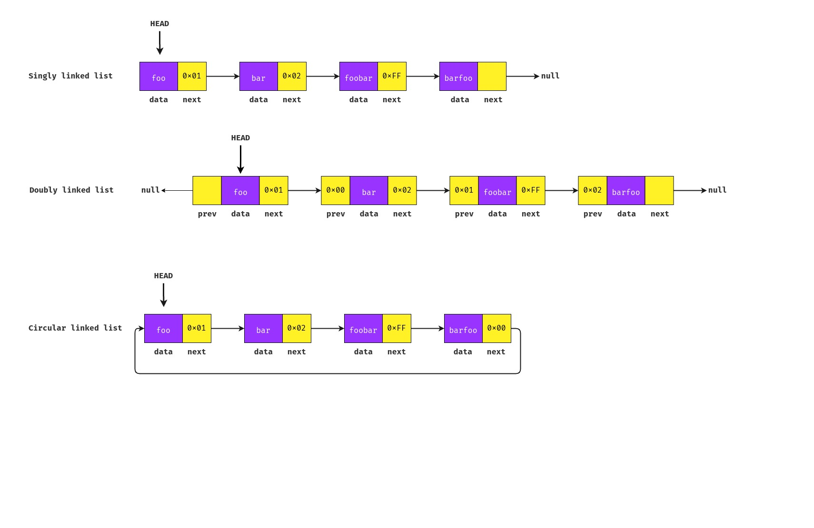

# Data structure - Linked List

## Definition

A Linked List consists of **nodes where each node contains data and a pointer to the next node** in the list.

Unlike arrays, linked lists are **not stored at a contiguous location**. Instead, the elements are **linked using pointers**.

## Linked List types

- **Singly linked list:** Can move or traverse a list in **one direction (forward)**. The last node points to null, **indicating the end of the list**.
- **Doubly linked list:** Can move or traverse a list in **both directions (forward and backward)**. The head previous points to null, **indicating the beginning of the list** and the last node points to null, **indicating the end of the list**.
- **Circular linked list :** Can move or traverse a list in **one direction (forward)**. Unlike singly linked list, the last node points to the head node, **indicating the circular reference**.

## Advantages of Linked Lists over Arrays

- Performs as a **dynamic Array**, not having a fixed size (no need to be redimensioned). Data can be **dynamic linked to the list**.
- **Easier insertion/deletion**. The data allocation is not sequencial (can link **any node by the memory address** wherever it is).

## Drawbacks of Linked Lists

- **Extra memory consumption** when compared to Arrays. Need to **store pointer address**.
- Random access not alllowed. **Need to access elements sequencially**, starting from the first node (**Not able to do efficient binary search**).
- **Not cache friendly**. Unknown element location.

## Algorithm time complexity (Big O Notation)

The table shown below represents the **time complexity of performing different operations** on Linked Lists.

| Operation                        | Notation |
|----------------------------------|----------|
| Cost of accessing elements       | **O(n)** |
| Insert/remove from the beginning | **O(1)** |
| Insert/remove from the end       | **O(n)** |
| Insert/remove from middle        | **O(n)** |

## Common operations

- `insert`  - Adds an element to a linked list.
- `remove` - Removes an element from a linked list.
- `search` - Sequentially search for a node in a linked list.
- `display` - Display linked list data.

## When to use Linked List

- You need **strong data consistency and allocation**.
