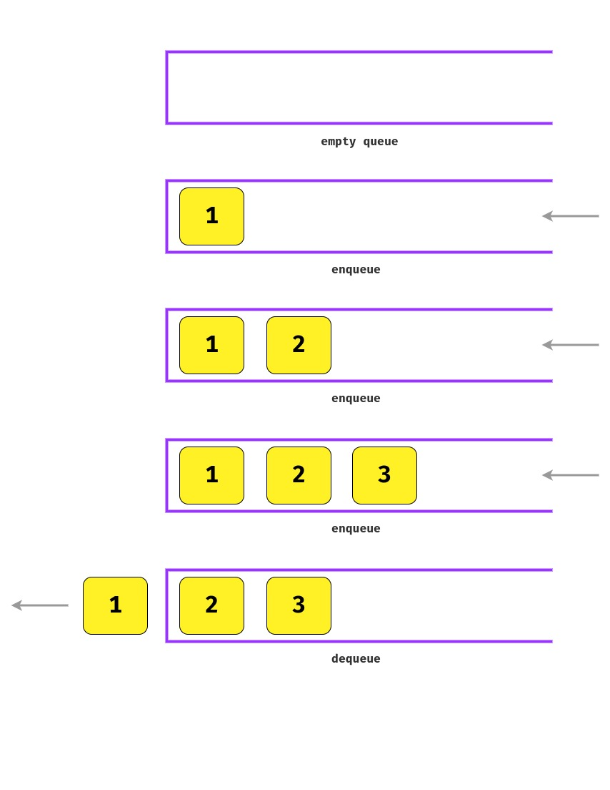

# Data structure - Queue

## Definition

A stack is a **FIFO** structure (the first placed element is also the first to be accessed). It's similar to a bank queue, where the first person entering the queue is the first person who gets attended.

## Algorithm time complexity (Big O Notation)

The table shown below represents the **time complexity of performing different operations** on Queues.

| Operation                  | Notation |
| -------------------------- | -------- |
| Cost of accessing elements | **O(n)** |
| Insert/remove an element   | **O(1)** |
| Get an element             | **O(1)** |

## Common operations

- `enqueue` - Adds an element to the end of the queue.
- `dequeue` - Removes the element on the beginning of the queue, returning the element.
- `front` - Returns the element on the beginning of the queue, without removing it.
- `size/length` Returns the queue length.

## When to use queues

- Elements need to be added or removed **in a sequential order**.
- Elements do not need to processed immediately but **have to be processed sequentially** later.
