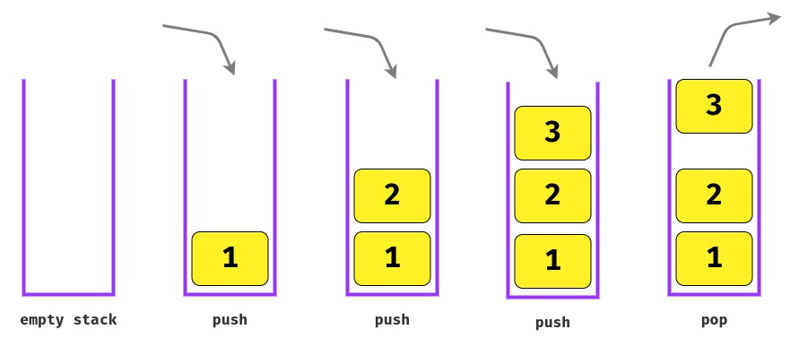

# Data structure - Stack

## Definition

A stack is a **LIFO** structure (the last placed element is the first to be accessed). It **stores data into a sort of "vertical tower"**, like a stack of books.

## Algorithm time complexity

The table shown below represents the **time complexity of performing different operations** on stacks.

| Operation                  | Array    | Linked List |
| -------------------------- | -------- | ----------- |
| Cost of accessing elements | **O(n)** | **O(n)**    |
| Insert/remove an element   | **O(1)** | **O(1)**    |

## Common operations

- `push` - Adds an element on the top of the stack.
- `pop` - Removes the element on the top of the stack, returning the element.
- `top/peek` - Returns the element on the top of the stack, without removing it.
- `size/length` Returns the stack length.

## When to use stacks

- Element need to be added or removed **from only one end, called the top**.
- You need to **keep the order** of actions.
