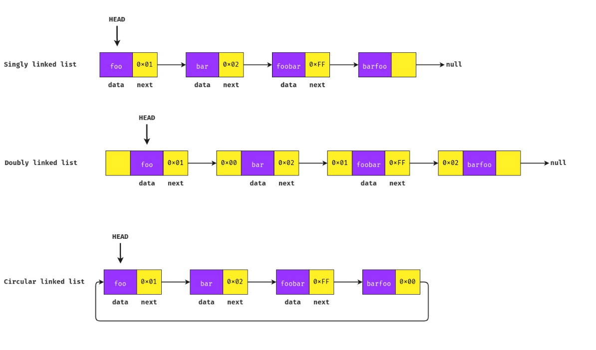

# Data structure - Linked List

## Definition

A Linked List consists of nodes where each node contains a data field and a address to the next node in the list.

Unlike arrays, linked lists are not stored at a contiguous location. Instead, the elements are linked using pointers.

### Types of Linked Lists

- **Singly linked list:** Can move or traverse a list in one direction (forward). The last node points to null.
- **Doubly linked list:** Can move or traverse a list in both directions (forward and backward). The last node points to null.
- **Circular linked list :** Can move or traverse a list in one direction (forward). Unlike singly linked list, the last node points to the head (first) node.

### Advantages of Linked Lists over arrays

- Dynamic Array by not having a predefined length. Data can be dynamic linked to the structure.
- Easy insertion/deletion. The allocation is not sequencial so we can link any node by its memory address wherever it is.

### Drawbacks of Linked Lists

- Extra memory consumption when compared to arrays. Need to store pointer address.
- Random access not alllowed. Need to access elements sequencially starting from the first node (Not able to do efficient binary search).
- Not cache friendly. Unknown element location.

## Basic operations

- `insert`  - Add a element to a linked list.
- `delete` - Delete a element from a linked list.
- `search` - Sequentially search for a node in a linked list.
- `display` - Display a node data.

## When to use Linked List

- strong data consistency and allocation needed.
- removing/inserting data is more important than searching.