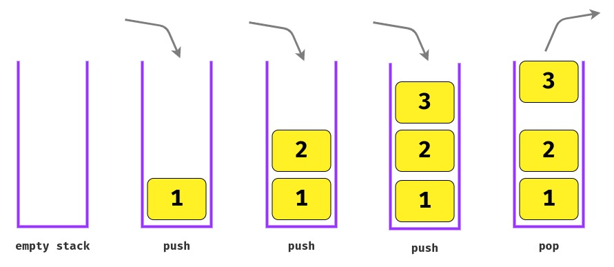

# Data structure - Stack

## Definition

A stack is a **LIFO** (Last In First Out - The last placed element is the first to be accesed) structure. It stores data into a sort of **"vertical tower"**, just like a stack of books or a stack of plates.

## Basic operations

- `push` - add an element to the top of a stack.
- `pop` - remove the element from the top of a stack.
- `top/peek` - return the element on the top of a stack.
- `size` return the size of stack.

## When to use stacks

- Redo/undo actions, like in editors such as Google Docs or Microsoft Office Word.
- Navigate forward and backward in Web browsers.
- Operating systems use stack for memory management. Each program that is running in a computer has its own memory allocations.
- Histograms problems.
